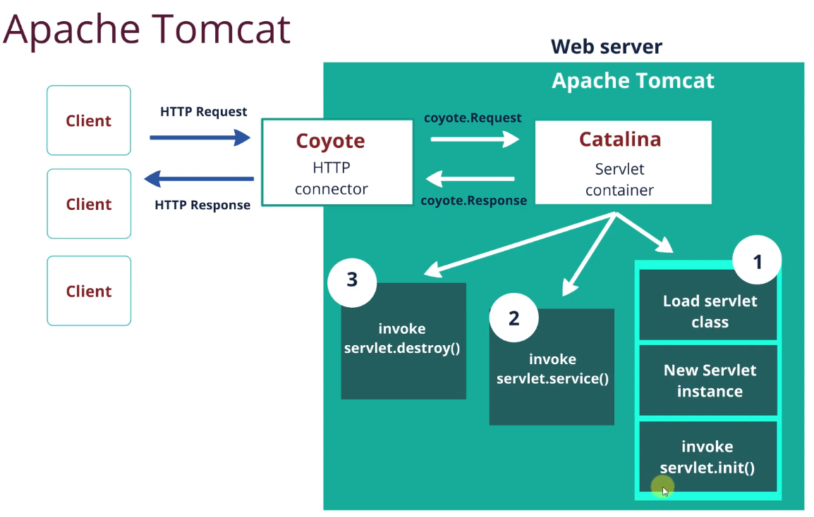

# Занятие 6. Servlet API, технология сервлетов

Servlet - Java class который позволяет обмениваться данными клиент-сервер.
HTTPServlet - Java class в jakarta.servlet.http конкретная реализация сервлета под http.

схема работы Apache Tomcat (детально описано в моей тетради можно спросить меня или посмотреть оригинальный ролик)

Чтобы из нашего класса получился сервлет нужно, extends HttpServlet, в нем переопределять методы doGet(), doPost() ...
У сервлета есть 3 основных метода (жизненый цикл)

1. init() - вызывается 1 раз при создании сервлета (паттерн одиночка, появляется в контейнере сервлетов).
2. service() - метод вызвается при каждом запросе, однако нет смысла его переопределять он под капотом просто сравнивает по http заголовку какой далее метод вызвать doGet(), doPost() ... можно сказать диспетчер, который переправляет изначальный запрос в нужный http-
   метод нашего сервлета.
3. destroy() - вызывается 1 раз при уничтожении сервлета

Иерархия сервлетов:

1. interface Servlet(init(), service(), destroy()) + interface ServletConfig
2. abstract class GenericServlet() implements Servlet, ServletConfig
3. HTTPServlet конкретная реализация под HTTP
