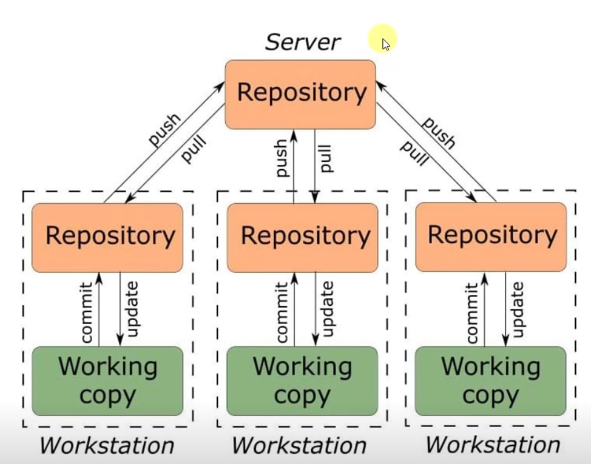

# GIT

Ничего нового просто про работу с гитом.

Гит - система контроля версий с распределенной архитектурой.
У нас есть главный удаленный репозиторий и на каждом компе есть локальный репозиторий, а также рабочий проект. Проект общается с локальным репозиторием при помощи commit, а локальный репозиторий общается с удаленным при помощи push/pull.

GitHub и GitLab – сервисы которые реализуют работу с этими репозиториями.
GitHub для open-source и предоставляют мне крутые фичи как студенту: copilot и jetbrains Ultimate edition на все.
Далее все база
