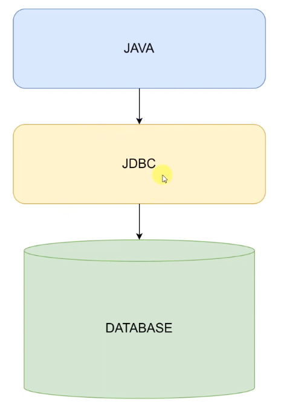
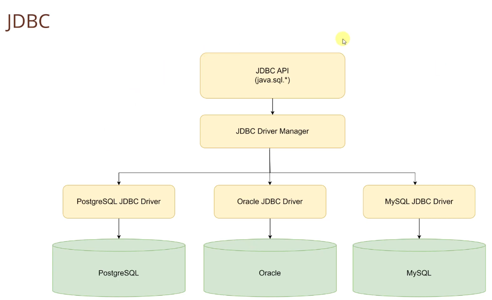
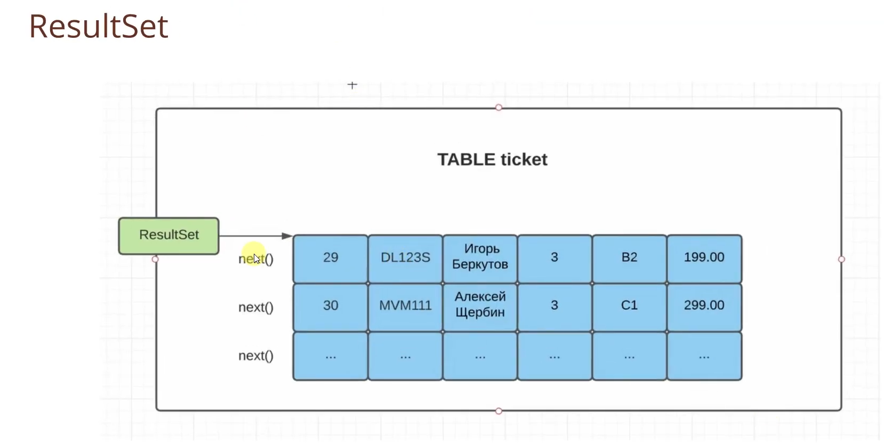
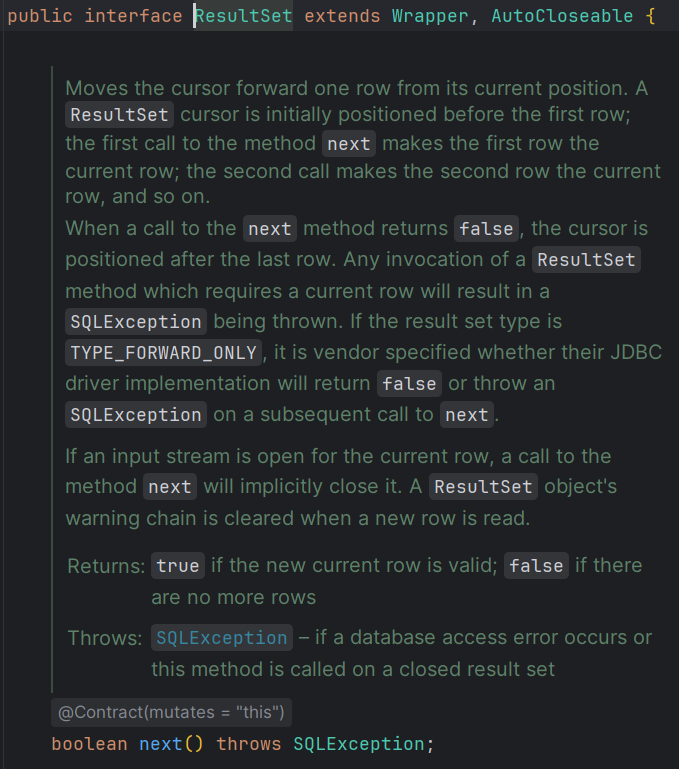
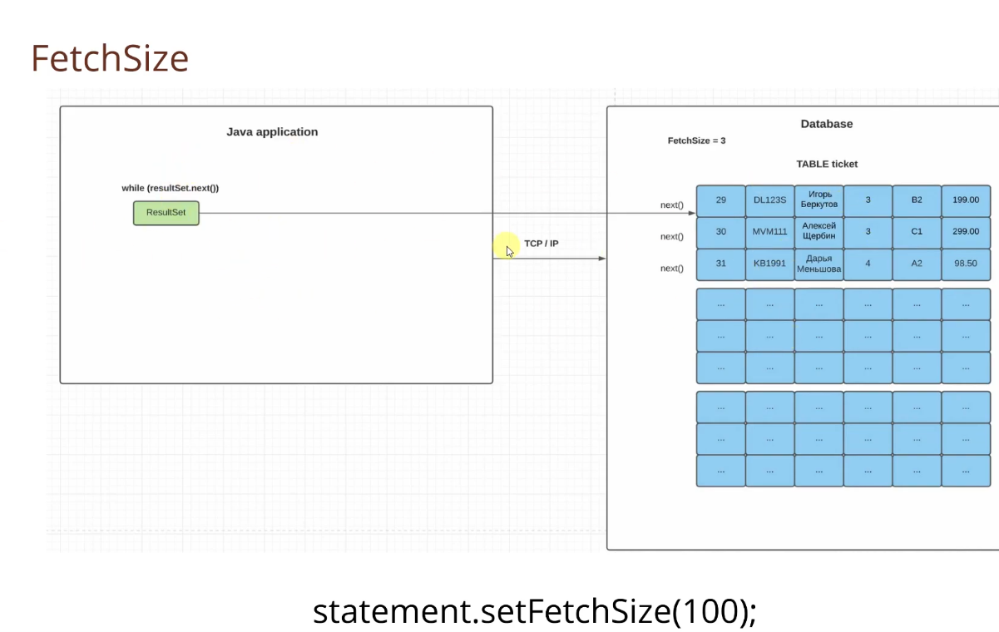
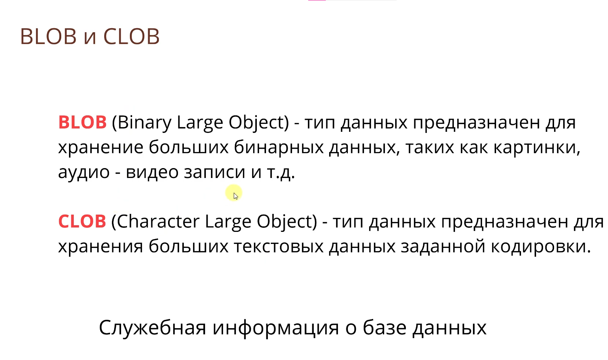

## Занятие 10. JDBC, часть 1, взаимодействие java программы и базы данных

Узнал что JDBC - это подключение к Базе Данных из Java. JDBC обеспечивает соединение(предоставляет методы для работы с БД).

 У нас есть главный интерфейс DriverManager мы вызываем его методы, а он уже вызывает конкретные драйвера под разную базу, драйвер просто подключаем как внешнюю библиотеку(зависимость) через maven/gradle. 

Написал 2 утилитных класса для получения connection с Базой Данных, PropertiesUtil работает с application.properties файлом и читает с него нужные значения, ConnectionManager возвращает нам готовое подключения для работы с БД.

Узнал про запросы из Java к БД, preparedStatement.

Statement - специальная сущность для обращения к БД под конкретный запрос.

PreparedStatement extends Statement - расширяет statement, позволяя ему избегать sql инъекции путем подстановки шаблонов, а не прямых значений в запросы SQL.

Результат выборки - ResultSet, он работает на подобии итераторов которые я писал в с++:

Вот как мы бегаем по resultSet

Так же по connection мы можем получить всю метаинфу про БД которая нам нужна, при помощи connetcion.getMetaData().
там очень много методов посмотреть все методы класса(в данном случае интерфейса можно при помощи alt + 7)

#### Занятие 10. Fetchsize

Чтобы наше приложение не улетало по OutOfMemoryException, есть параметр Fetchsize, который возвращает порциями нашу табличку. Это увеличит количество "перегонов" туда-сюда, но сэкономит память! есть еще 2 полезных метода pst.setMaxRows(100) - не надо больше 100 записей, а также pst.setQueryTimeout(10) - если в течении 10 сек не пришел ответ с БД, выбрасываю TimeoutException.

Cпециальные типы данных для хранения больших обьектов.

blob -> bytea

clob -> text
