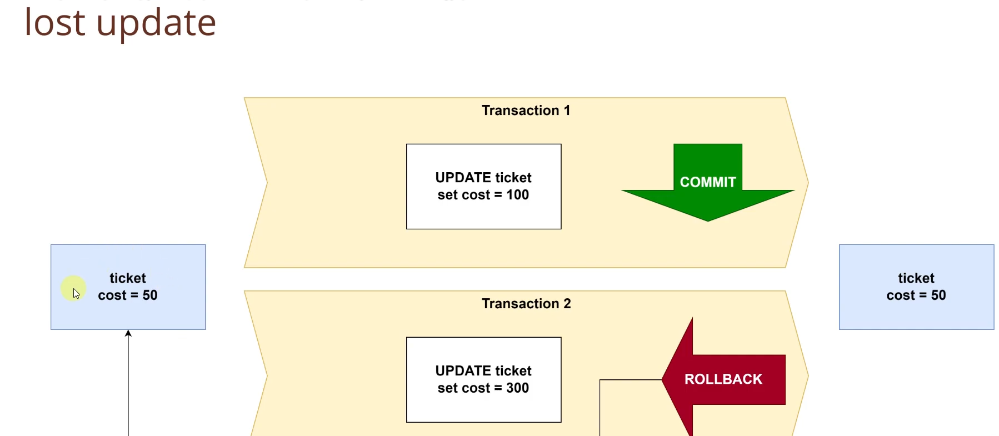
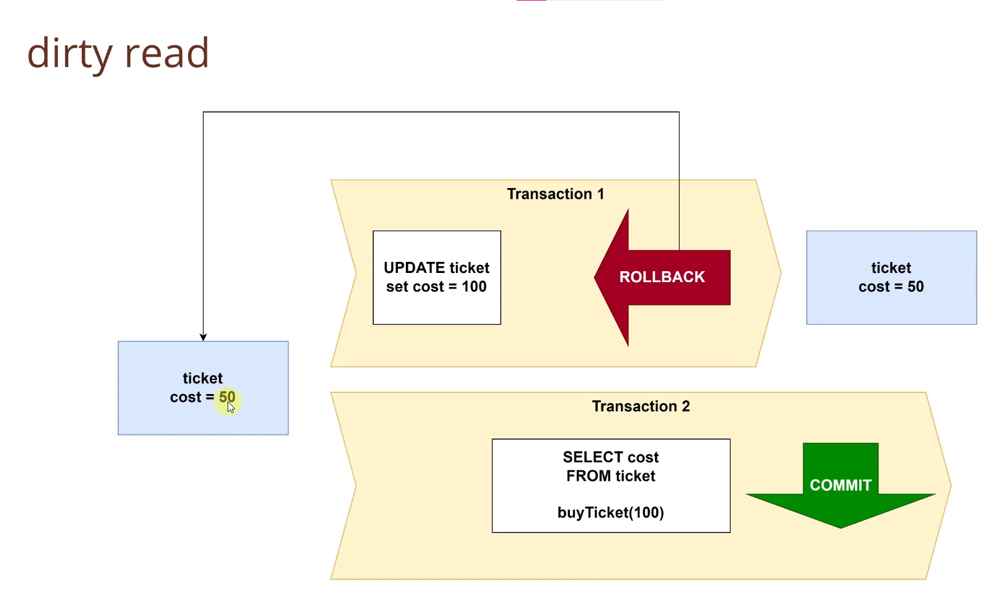
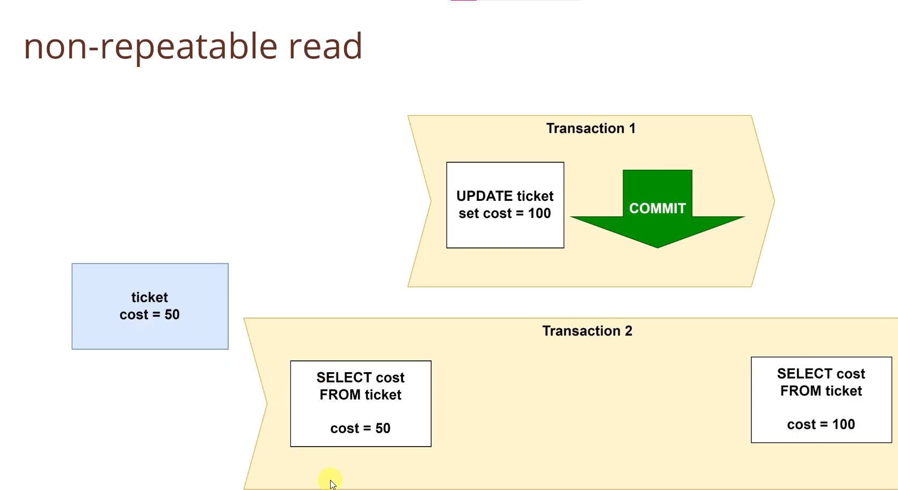
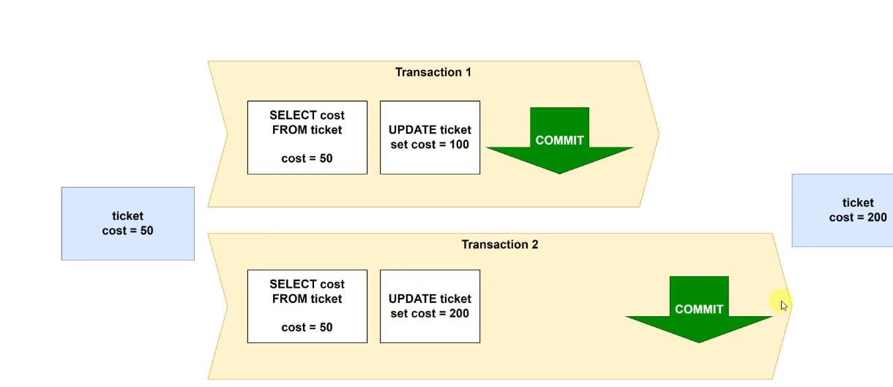
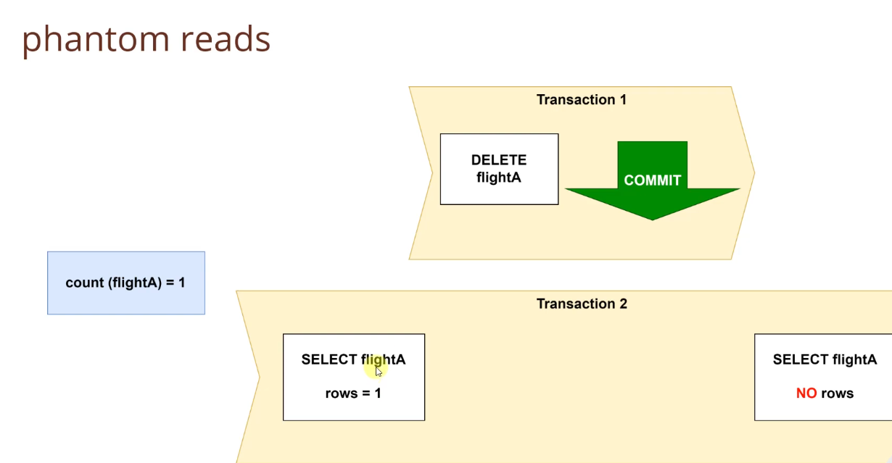
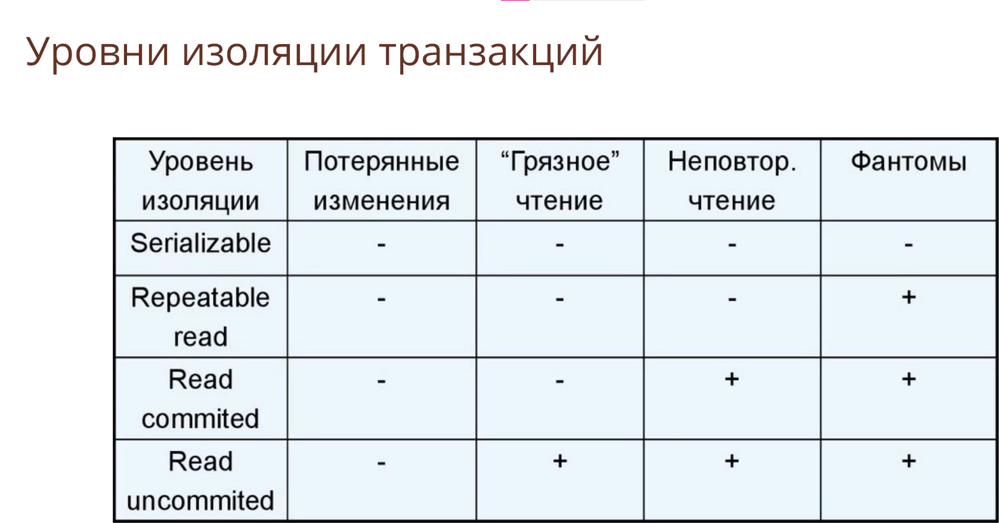

## Занятие 11. JDBC, часть 2, ACID (транзакции) и Connection Pool

Транзакции, ACID, проблемы при параллельном доступе транзакций:

1. **Lost update** (потерянное обновление)
   
   Проблема параллельного доступа.
   пофикшено по умолчанию на уровне СУБД.
2. **Dirty read** (грязное чтение)
   
   уровень изоляции по умолчанию решает эту проблему в postgres.
3. **Non-repeatable read** (неповторяемое чтение - в рамках одной транзакции два одинаковых запроса возвращают разную выборку, т.к. другая тразакция обновила эти данные)
   Проблема изменения строки
   Решение: блокировать одну запись в табличке.
   
4. **Last commit wins** (последний коммит побеждает)
   
5. **Phantom reads** (фантомные чтения)
   
   Проблема добавления/удаления строк
   Решение: Полная изоляция таблицы

   Все проблемы можно решить при помощи уровней изоляции и какой-то логике в нашем коде
   
   Уровень изоляции - фактически это то насколько сильно все синхронизированно и не позволяет двум потоком одновременно работать с одинаковыми сущностями. Чем больше уровень изоляции, тем медленнее все работает, ищем золотую середину.

#### Занятие 11. Connection Pool

По сути корзиночка в которой уже лежат открытые коннекты, для работы с БД, выполнили запрос, положили на место, похоже на pool из многопоточности.
